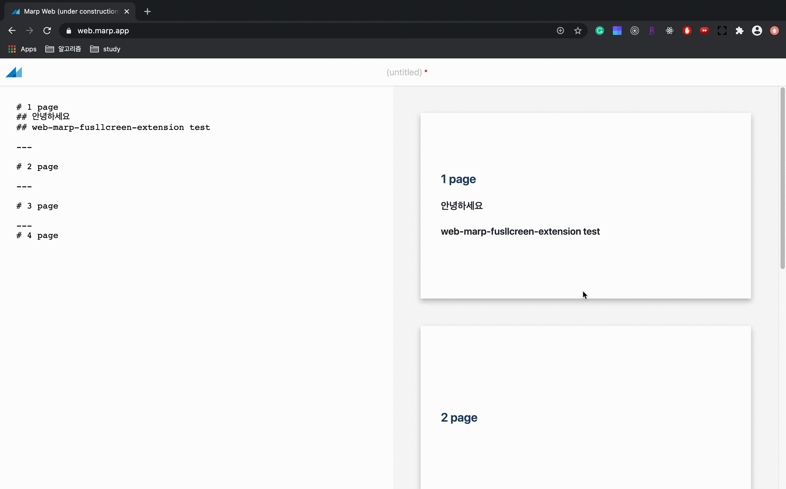

# web-marp-fullscreen-chrome-extension
현재, [웹 마프](https://web.marp.app/)는 풀 스크린 모드, 즉 발표모드를 지원하지 않습니다.
web-amp-fullscreen-extension을 통해 발표모드를 실행할 수 있습니다.

## Demo

## 설치 및 실행
앱 검토 완료 후
> ~~(링크)[https://chrome.google.com/webstore/search/webmarpfullscreen]에서 해당 크롬 익스텐션을 설치하여 실행한다.~~ (현재, 앱 검토 대기 중)

앱 검토 완료 전
> 크롬 도구 더보기 >> 확장 프로그램 >> 압축해제된 확장 프로그램 로드(Load unpacked extension) >> src 폴더 업로드
